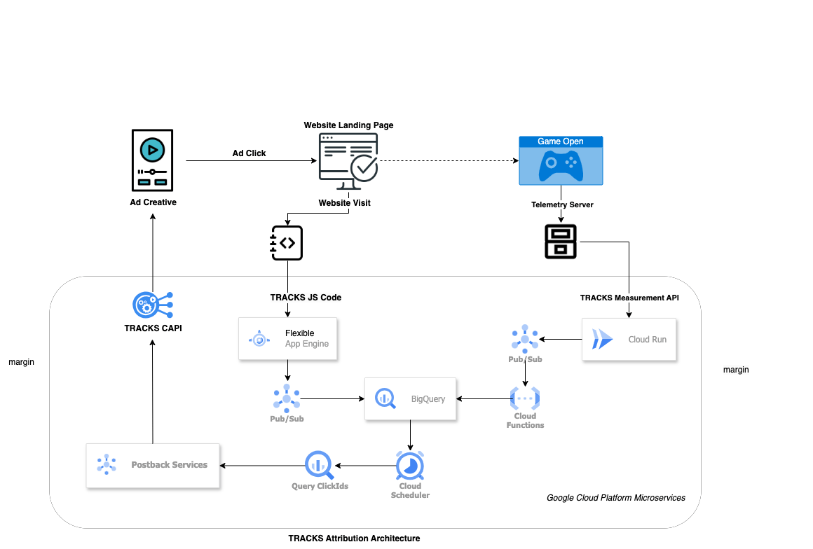

# TRACKS Measurement API

<p class="docs-audience">For: Backend engineer</p>

The Measurement API tracks the customer acquisition source, enabling you to identify which channels, campaigns, ads drive install and other in-game events. By integrating with TRACKS Attribution, you can accurately attribute conversions to the correct media sources, helping you optimize your marketing efforts.

## Architecture

<figure markdown="span">
  
  <figcaption>Measurement API — backend webhook → Cloud Run → BigQuery</figcaption>
</figure>

## Prerequisites

Before you begin, please ensure the following. These apply to the server-side integration described below. The plugin route has its own, much shorter, requirements — see [Telemetry](telemetry.md).

- A Google Cloud Platform account with billing enabled (Google Cloud Platform microservices will auto-scale as needed for your game).
- Access to Measurement API credentials (API key and secret — these are delivered to you via a setup email from Second Stage once your cloud project is provisioned).
- A TRACKS account with the attribution package enabled and ready for integration.
- Basic knowledge of server-side programming, cloud services, and API integrations.
- A telemetry server capable of reading and collecting client IPs via HTTP headers or X-Forwarded-For (XFF).
- A webhook, postback, or proxy mechanism that can trigger real-time Measurement API requests or perform batch uploads via cron jobs.

## Integration approach

To integrate with TRACKS Attribution, you'll need to create and implement a lightweight server-side HTTP request as a webhook on your backend. This is the recommended integration method. If your game has no telemetry backend, see [Telemetry](telemetry.md) for the plugin option.

The webhook should trigger every time a game open (session start) event is logged in your telemetry system.

The Measurement API endpoint requires the following parameters:

- IP address
- User ID
- Event timestamp
- Platform
- Storefront

For each game added, the Second Stage Analytics team provides comprehensive support for integration, deployment, and testing, starting with an onboarding call.

??? abstract "API Request pseudo-code example"

    ```json
    # Example Python Code for server-side telemetry
    import requests


    url = "https://tracks.your-game.com/measure"  


    payload = {
     'user_id': '1a23fd44c21f8l5r',
     'event_name': 'game_open',
     'ip': '175.124.248.15',
     'time_stamp': '1724094783',
     'platform': 'pc',
     'storefront': 'steam'
    }
    headers = {
     'Authorization': 'Bearer API_KEY_TOKEN'
    }
    response = requests.request("POST", url, headers=headers, data=payload)
    print(response.text)   
    ```

## Endpoints

To track media channel acquisition sources, you need to implement the API endpoints that record acquisition events.

!!! note "Which endpoint do I implement?"

    `/collect` is triggered client-side from your landing page. The Second Stage team deploys it for you via Google Tag Manager — see [Landing Page Integration](../platform/landingpages.md). You do **not** need to call it from your backend.

    `/measure` is triggered server-side when a game-open (session start) event is logged. This is the endpoint you need to implement in your own telemetry backend using the pseudo-code example above.

### `POST /collect` — Record web acquisition events

| Field | Value |
|---|---|
| **Endpoint URL** | `https://tracks.yourgame.com/v1/collect` |
| **Method** | `POST` |
| **Auth** | `Authorization: Bearer <API_KEY>` |
| **Content-Type** | `application/json` |

**Description:** Records web events, capturing details about the acquisition source.

**Example:**

```
    # Example Python Code for web client-side
    import config
    import requests


    def track_acquisition(data):
       headers = {
           'Authorization': f'Bearer {config.API_KEY}',
           'Content-Type': 'application/json'
       }
       try:
           response = requests.post("https://tracks.yourgame.com/v1/collect", json=data, headers=headers)
           response.raise_for_status()
           print('Acquisition event recorded:', response.json())
       except requests.exceptions.HTTPError as err:
           print('Error recording acquisition event:', err.response.json())


    acquisition_data = {
       "event_name": "web_visit",
       "timestamp": "2024-08-29T12:00:00Z",
       "channel": "paid_search",
       "campaign": "summer_sale",
       "source": "google",
       "medium": "cpc",
       "term": "steamsale",
       "content": "ad_1",
       "clientId": "12345",
       "sessionId": "abcdef123456",
       "ip": "175.124.248.15",
       "device": "mobile",
       "browser": "chrome"
    }


    track_acquisition(acquisition_data)
```

### `POST /measure` — Record game session events

| Field | Value |
|---|---|
| **Endpoint URL** | `https://tracks.yourgame.com/v1/measure` |
| **Method** | `POST` |
| **Auth** | `Authorization: Bearer <API_KEY>` |
| **Content-Type** | `application/json` |

**Description:** Records web events, capturing details about the acquisition source.

**Example:**

```
    # Example Python Code for server-side telemetry
    import requests

    url = "https://tracks.yourgame.com/v1/measure" 

    payload = {
     'user_id': '1a23fd44c21f8l5r',
     'event_name': 'game_open',
     'ip': '175.124.248.15',
     'timestamp': '2024-08-29T12:00:00Z',
     'platform': 'pc',
     'storefront': 'steam'
    }
    headers = {
      'Authorization': f'Bearer {config.API_KEY}',
    }
    response = requests.request("POST", url, headers=headers, data=payload)
    print(response.text)
```

## Testing

**Test the integration:**

- Click on a UTM-tagged test link and open the game for the first time.
- Ensure your server is running and correctly configured to handle HTTP requests.
- Trigger acquisition events manually or through your application to test the integration.
- Check Cloud Run logging to confirm that the endpoint logs show no errors.
- Verify on the attribution tool dashboard that acquisition events are tracked accurately.
- Ensure that the data (channels, campaigns, sources) aligns with your expectations.

## Troubleshooting

- **Invalid Credentials:** Confirm that your API key and secret are correct and have the necessary permissions.
- **Network Errors:** Review your server’s network configuration and API base URL.
- **Data Mismatches:** Ensure the event payload matches the required schema and that timestamp formats are correct.

### HTTP status codes

- **200 / 204** — Request accepted. Event is queued for processing.
- **400** — Malformed payload. Check the required fields (`user_id`, `event_name`, `ip`, `timestamp`, `platform`, `storefront`) and the timestamp format.
- **401** — Missing or invalid `Authorization` header. Verify the bearer token is sent exactly as `Bearer <API_KEY>`.
- **403** — Credentials are valid but don't have permission for this endpoint. Contact the Second Stage team to confirm API key scope.
- **5xx** — Transient server-side error. Retry with exponential backoff; if it persists, contact the Second Stage team.

If problems persist after checking the above, reach out via the [support channels](../support/contact.md).
