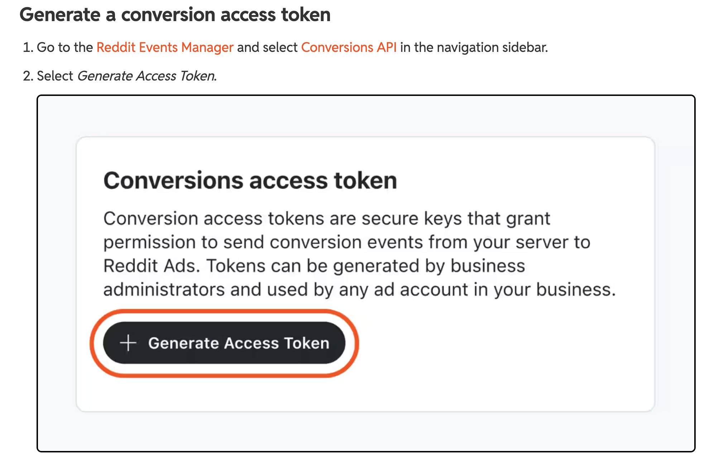

# Reddit Conversion API

For: Ad ops / backend engineer

[→ Conversions API Setup Guide for Reddit](https://business.reddithelp.com/helpcenter/s/article/Conversions-API)

!!! note

    Complete the [Reddit Ads access integration](../../platform/mediachannels/reddit-ads.md) first.

Reddit access given prior would be sufficient for TRACKS to activate Conversion API for Reddit. A conversion access token is created through the Reddit Events Manager and can be generated by any **Reddit account administrator**. Once generated it can be used by any ad account in your business.

## Generate the conversion access token

<ol class="setup-steps" markdown="1">

<li markdown="block">

### Open the Conversions API section

Go to the **Reddit Events Manager** and select **Conversions API** in the navigation sidebar.

</li>

<li markdown="block">

### Generate the token

Select **Generate Access Token**.

</li>

<li markdown="block">

### Send the token

Send the generated token to the Second Stage team to enable Reddit install postbacks.

</li>

</ol>

<figure markdown="span">
  
  <figcaption>Reddit Events Manager → Conversions API → Generate Access Token</figcaption>
</figure>

## Conversion event mapping

Install postbacks are sent under the standard Reddit event **Purchase**. Tell your Second Stage contact if you would like them mapped to a different conversion event.

For your reference, Reddit’s documentation required for CAPI is listed here:

[→ Reddit Conversion Access Token](https://business.reddithelp.com/helpcenter/s/article/conversion-access-token)

[→ Conversions API Setup Guide for Reddit](https://business.reddithelp.com/helpcenter/s/article/using-the-API-for-conversions)
