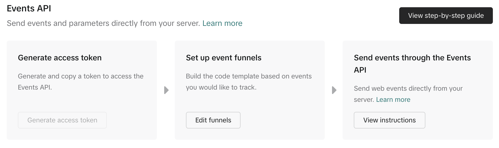

# TikTok Conversion API

For: Ad ops / backend engineer

[→ Conversions API Setup Guide for TikTok](https://business-api.tiktok.com/portal/docs?id=1738855176671234)

!!! note

    Complete the [TikTok Ads access integration](../../platform/mediachannels/tiktok-ads.md) first.

A TikTok business developers account is needed for the Conversion API. Follow the registration steps by choosing “Direct Advertiser”. After your developer profile is approved, inform your Second Stage contact to handle creating the [Business App](https://business-api.tiktok.com/portal/docs?id=1738855242728450) and configuring the [Web Events API](https://business-api.tiktok.com/portal/docs?id=1739584855420929).

Standard Access for the pixel to `analytics@secondstage.io` is required.

## Create the pixel and generate the token

<ol class="setup-steps" markdown="1">

<li markdown="block">

### Connect a data source

In TikTok Events Manager, go to **Connect Data Source**.

</li>

<li markdown="block">

### Select Web and enter your site

Choose **Web** and enter the site that hosts your landing page.

</li>

<li markdown="block">

### Choose Manual Setup

Select **Manual Setup** rather than a partner integration.

</li>

<li markdown="block">

### Create and name the pixel

Any name is fine. Click **Continue**. If you are prompted to configure events, select **Do Later** — Second Stage configures the events.

</li>

<li markdown="block">

### Copy the Events API Token

Once the pixel is created, copy the **Events API Token** and send it to the Second Stage team to enable TikTok install postbacks.

</li>

</ol>

<figure markdown="span">
  
  <figcaption>TikTok Events Manager → Events API → Generate access token</figcaption>
</figure>

## Share the pixel

After the pixel is created, share it with both your ad account and the Second Stage analytics user.

<ol class="setup-steps" markdown="1">

<li markdown="block">

### Open the pixel

In Events Manager, go to **Assets → Data Sources** and select the pixel you just created.

</li>

<li markdown="block">

### Open permissions

Go to the **Manage Permissions / Assign Assets** section.

</li>

<li markdown="block">

### Add the ad account and the analytics user

Add your active **TikTok Ad Account** so campaigns can use the pixel, and add `analytics@secondstage.io` with **Standard Access** so Second Stage can configure and manage the postbacks. Save your changes.

</li>

</ol>

## Conversion event mapping

Install postbacks are sent under the standard TikTok event **Purchase**. Tell your Second Stage contact if you would like them mapped to a different conversion event.
