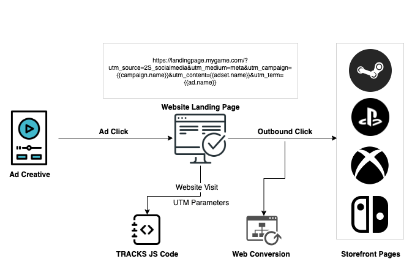
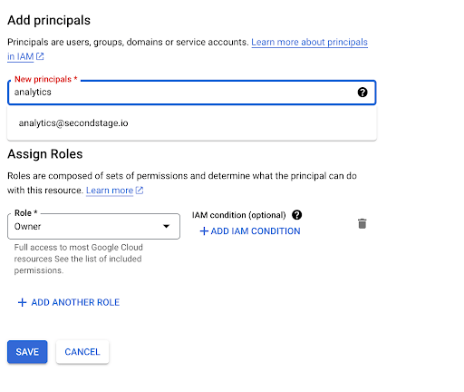
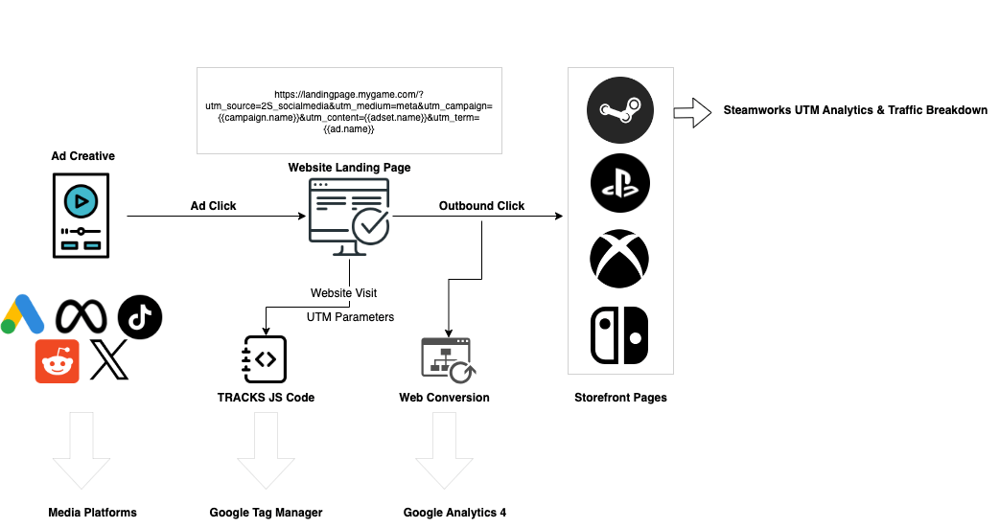
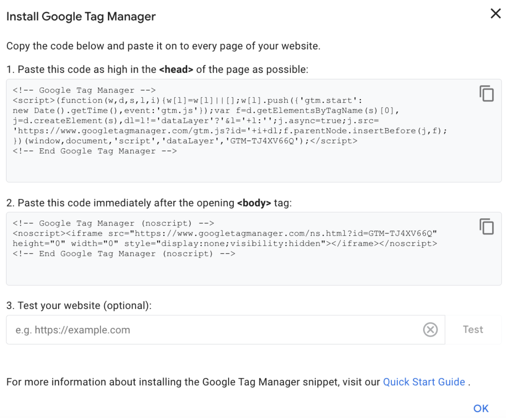
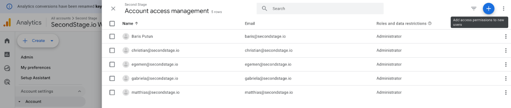
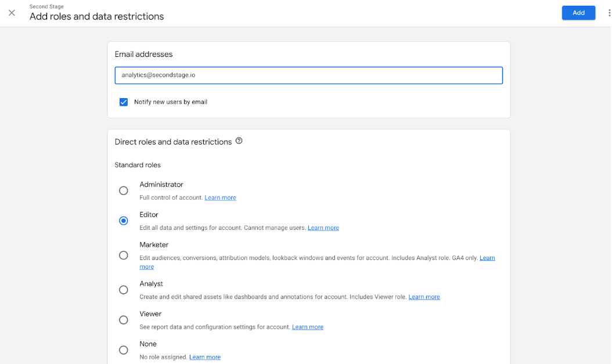

# Landing Page Integration

<p class="docs-audience">For: Web / Marketing admin (GTM access)</p>

!!! tip "Important:"

    Required for Modeled Attribution Tracking, Measured Attribution Tracking, Measured Attribution Tracking + Modeling. See [Methodologies](../support/attribution.md#methodologies) for what each tracking mode means.
    By linking TRACKS with Steamworks, Google Analytics 4 and Google Tag Manager access, you will be able to use the Modeled Installs reporting feature. Please note that postbacks only work if you are using the Measured Attribution Tracking or Measured Attribution Tracking + Modeling solution. 

By embedding the TRACKS JavaScript code into your landing page, minimal technical data — such as IP address and user-agent — is passively collected as part of the standard HTTP request. No cookies, LocalStorage, or other client-side storage mechanisms are used. This data is pseudonymized (e.g., through salted hashing of IP addresses), retained temporarily (e.g., for 30 days), and only becomes relevant when the second measurement point is triggered. Any actual fingerprinting or attribution is based on the combination of both signals, with consent requirements potentially applying at that later stage, depending on the implementation and legal basis selected by the data controller.

To ensure accurate attribution when using your website as the attribution source, it’s important to correctly implement UTM tagging in your paid media or content creator campaigns. We recommend using the TRACKS UTM builder sheet to properly generate tracking links for your landing page (please refer to Marketing Analytics > Setup for more information).

<figure markdown="span">
  
  <figcaption>How web visits and storefront click-throughs flow into TRACKS attribution</figcaption>
</figure>

An additional benefit of using your landing page with the TRACKS JavaScript snippet is the ability to track not only paid media, but also web referrals and organic traffic. This means that even without running paid media ads, you can still monitor and report on installs generated from organic referral sources. We also recommend applying UTM tagging to your owned media, such as CRM emails and social media, to further expand your attributed install data.

In addition, the TRACKS JavaScript code automatically applies UTM parameters to your outbound storefront links. When a visitor with a defined acquisition source, medium, or referral clicks on the storefront buttons and navigates to platforms like Steam, the UTM information is captured and transferred to the storefront page. This allows for seamless integration between Google Analytics and Steamworks Analytics, providing a comprehensive view of your traffic sources.

Implementation of the TRACKS JavaScript code is managed by the Second Stage team and requires access to Google Tag Manager as described below. If you do not already have Google Tag Manager installed on your landing page, we can help you integrate it.

By providing access to Google Tag Manager, we will be able to configure the following:

- **Google Analytics 4 (GA4) for website conversion measurement and identifying session/visit sources:**
    TRACKS integrates with GA4 to capture a session's acquisition source and access multi-channel funnel data. As mentioned in the features section, TRACKS also uses web conversions as a key source of behavioral data that is included in the reporting suite as web conversion metrics.
If GA4 is not already set up on your site, provide us with access to Google Tag Manager at analytics@secondstage.io and we will create and configure it for you. If GA4 is already installed, granting access will enable us to audit and optimize your analytics setup for your marketing campaigns.

- **Media platform web pixel tagging**: 
    By granting Google Tag Manager and media platform access to analytics@secondstage.io, TRACKS can set up a web conversion event or pixel if one is not already in place. You can use this event to optimize your media platform campaigns in addition to Install Postbacks. Since web conversion events provide valuable insights into user behavior, it’s recommended to include them in your conversion objective campaigns. When used alongside the Installs (game_opens) event, this creates an optimized conversion funnel, helping you achieve the best possible campaign performance.

The code snippet below is what the Second Stage team deploys on your behalf through GTM — you don't need to paste it yourself. It's included here for reference so you can see what ends up in your container.

??? abstract "Pseudo-code example"
    ```json
    <script>
    // TRACKS by Second STAGE Web Snippet
    (function (A, S, D, F, W, E) {
     (A.tracks =
       A.tracks ||
       function () {
         (A.tracks.q = A.tracks.q || []).push(arguments);
       }),
       (A.tracks.q = []),
       (A.tracks.r = 1 * new Date());
     (W = S.createElement(D)), (E = S.getElementsByTagName(D)[0]);
     W.async = 1;
     W.src = F;
     E.parentNode.insertBefore(W, E);
    })(window, document, "script", "https://cdn.tracks-2s.com/collect.js");
    tracks("page_view", "2S-XXXXXX");
    </script>
    ```

Each game will be assigned a unique token to replace "2S-XXXXX." After granting Google Tag Manager access, you'll be able to see the TRACKS JavaScript snippet deployed in your GTM container.

*Example*

<figure markdown="span">
  
  <figcaption>The TRACKS JavaScript snippet as it appears in a GTM container</figcaption>
</figure>

<figure markdown="span">
  
  <figcaption>Data sources TRACKS will ingest once GTM, GA4, and Steamworks are connected</figcaption>
</figure>

## Google Tag Manager Integration & Access

TRACKS implements events and conversion pixels on your website to optimize landing page interactions and improve media platform targeting algorithms, as detailed above. This requires a Google Tag Manager container on your landing page and Publish access for the Second Stage team — see [Inviting Second Stage to Your GTM Account](#inviting-second-stage-to-your-gtm-account) below.

### Setting Up Google Tag Manager

If you don't already have Google Tag Manager installed on your website, follow these steps to set it up. For the full official walkthrough, refer to the Google documentation [here](https://support.google.com/tagmanager/answer/14842164).

<ol class="setup-steps" markdown="1">

<li markdown="block">

### Create an Account

Go to [tagmanager.google.com](https://tagmanager.google.com), sign in with your Google account, and click **Create Account**.

</li>

<li markdown="block">

### Set Up Container

Enter a name (e.g., your business name), select the country, name your container (e.g., website domain), and choose **Web** as the target platform.

</li>

<li markdown="block">

### Accept Terms

Agree to the Data Processing Terms.

</li>

<li markdown="block">

### Install the Code

GTM will provide two code snippets.

- **Snippet 1:** Paste this into the `<head>` of your website as high as possible.
- **Snippet 2:** Paste this immediately after the opening `<body>` tag.

</li>

<li markdown="block">

### Verify Installation

Use the **Preview** button in GTM to enter your website URL and confirm the container is loading correctly.

</li>

<li markdown="block">

### Publish

Click **Submit** in the top right corner to publish your container, making the changes live.

</li>

</ol>

### Implementing the GTM Code on Your Landing Page

When you create your container, GTM opens an **Install Google Tag Manager** dialog with two code snippets (shown below). Each snippet starts with `<!-- Google Tag Manager -->` and ends with `<!-- End Google Tag Manager -->`, and both contain your unique container ID in the form `GTM-XXXXXXX`. If you closed the dialog, you can reopen it any time from **Admin → Install Google Tag Manager**, or by clicking your container ID (`GTM-XXXXXXX`) in the top bar of the GTM workspace.

Add both snippets to **every page** of your landing page:

- **Snippet 1 (the `<script>` block):** Copy it and paste it into the `<head>` of your page, as high up as possible — ideally as the first item in the `<head>`.
- **Snippet 2 (the `<noscript>` block):** Copy it and paste it immediately after the opening `<body>` tag.

If your landing page is built on a CMS or page builder, add Snippet 1 to the global header/`<head>` section and Snippet 2 to the global body-open section so they load on every page. Once both are in place, use the **Test your website** field in the same dialog (or the **Preview** button) to confirm the container is detected, then **Submit** to publish.

<figure markdown="span">
  
  <figcaption>GTM install — paste snippet 1 in <code>&lt;head&gt;</code>, snippet 2 right after <code>&lt;body&gt;</code></figcaption>
</figure>

### Inviting Second Stage to Your GTM Account

So that the Second Stage team can implement and maintain the TRACKS events and conversion pixels, please grant **Publish** access to `analytics@secondstage.io`. Publish is the highest container permission and lets us deploy changes live without you having to publish each one manually.

<ol class="setup-steps" markdown="1">

<li markdown="block">

### Open User Management

In Google Tag Manager, open **Admin**. Under the **Container** column, click **User Management**.

</li>

<li markdown="block">

### Add a User

Click the **+** button in the top right corner and choose **Add users**. Enter the email address `analytics@secondstage.io`.

</li>

<li markdown="block">

### Set Container Permissions

Under **Container Permissions**, enable **Publish** (this automatically includes Read, Edit, and Approve). Leave account permissions at the default **User** level.

</li>

<li markdown="block">

### Send the Invitation

Click **Invite**. We'll receive an email invitation and confirm once access is set up.

</li>

</ol>

## Google Analytics Integration & Access

In Google Analytics (GA4), please grant Editor access to analytics@secondstage.io. For guidance on creating a GA4 account, refer to the documentation [here](https://support.google.com/analytics/answer/9304153). Alternatively, the Second Stage team can create one for you if needed.

<figure markdown="span">
  
  <figcaption>GA4 access management — add analytics@secondstage.io with Editor role</figcaption>
</figure>

<figure markdown="span">
  
  <figcaption>Confirm Editor access so TRACKS can audit and configure conversion events</figcaption>
</figure>
