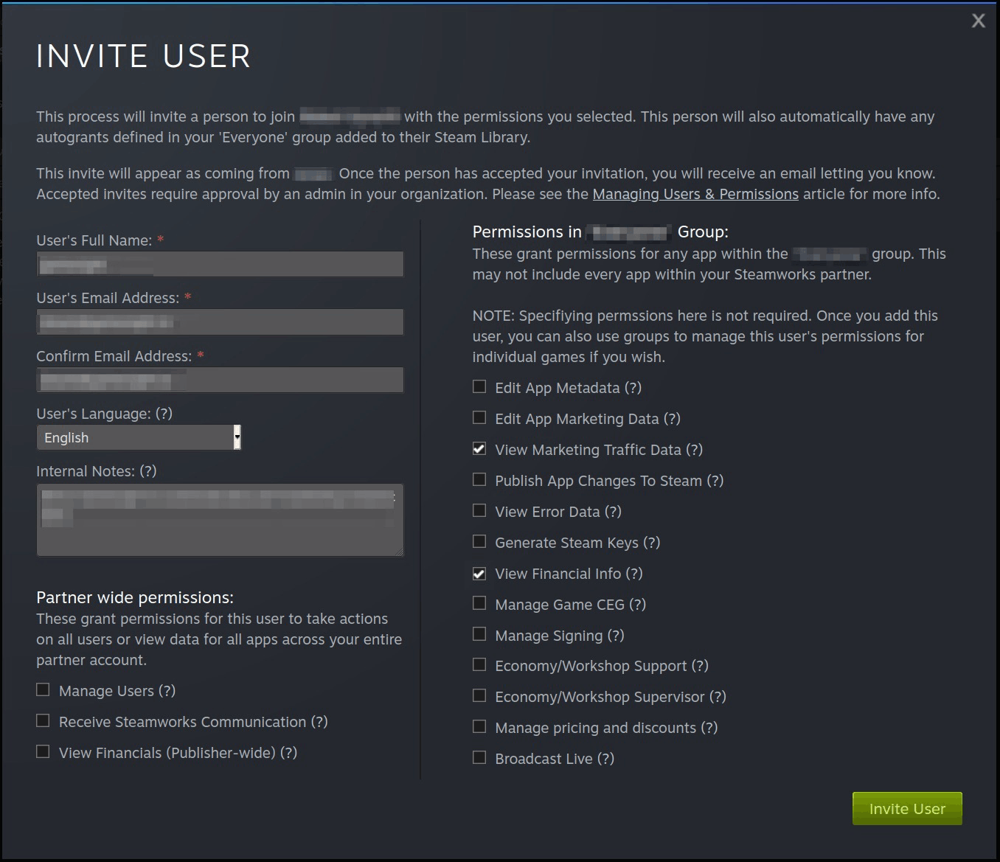

# Steamworks Integration

For: Steam marketing admin

Steamworks access is required to enable marketing attribution on Steam. It provides secure access to app-specific data (e.g., Steam App ID, user actions, transaction events) that can be used to match off-platform campaign metadata with on-platform conversions. This access is important for activating attribution pipelines and integrating with TRACKS.

## Steamworks Access

If your game is available on Steam, please grant us access by sending an invitation to analytics@secondstage.io. **We recommend granting both of the following read-only permissions:**

- **View Marketing Traffic Data** — lets TRACKS match traffic landing on your Steam page back to the campaigns that drove it.
- **View Financial Data** — gives us your actual wishlist additions broken down by market, which we use for accurate Cost Per Wishlist (CPWL) modelling in TRACKS.

Granting both means TRACKS works from your real Steam numbers, so wishlist reporting and CPWL are as accurate as Steam's own data.

### What each level of access enables

| Access granted | What TRACKS can report |
| --- | --- |
| **Marketing Traffic Data + Financial Data** *(recommended)* | Total wishlists *and* paid (campaign-attributed) wishlists, broken down by market — actual figures, so CPWL is as accurate as Steam's own data. |
| **Marketing Traffic Data only** *(fallback)* | Paid (campaign-attributed) wishlists only. Total wishlists are *modelled* as an approximation — fine for directional evaluation, but less accurate. |

If you can only grant Marketing Traffic Data, TRACKS still works — we simply model total wishlist volume and flag those figures as approximations. Wherever possible, though, we recommend granting both so reporting is based on actuals rather than estimates.

!!! note "Read-only grant"

    Both permissions are one-way, read-only grants. They do not give TRACKS access to your game's code, builds, or the ability to make any changes in Steamworks. No other Steamworks permissions are required.

### Granting Second Stage Access in Steamworks

<ol class="setup-steps" markdown="1">

<li markdown="block">

### Open Users & Permissions

In Steamworks, navigate to **Users & Permissions → Manage Users**. This is where you invite and manage everyone who can access your app's data.

</li>

<li markdown="block">

### Invite New User

Click **Invite New User** and enter the email address `analytics@secondstage.io`. Steam sends an invitation to join your Steamworks group.

</li>

<li markdown="block">

### Select Permissions

For your app, check **View Marketing Traffic Data** and **View Financial Data**. Leave all other permissions unchecked — these two are all TRACKS needs.

</li>

<li markdown="block">

### Send Invitation

Confirm to send the invitation. We'll let you know once access is set up and the integration is active.

</li>

</ol>

<figure markdown="span">
  
  <figcaption>Steamworks → Users & Permissions → Invite New User (View Marketing Traffic Data + View Financial Data)</figcaption>
</figure>

## Related

- [Tracking Links](../support/trackinglinks.md) — UTM-tagged URLs that drive attributable traffic to your Steam page.
- [Landing Page Integration](landingpages.md) — the TRACKS JavaScript snippet automatically appends UTM parameters to outbound storefront links so Steam traffic is attributed alongside web visits.
