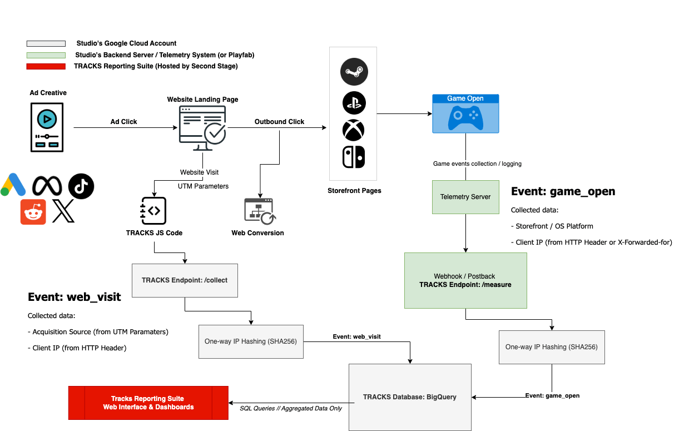

# Architecture

How TRACKS is built — the data sources that feed it, the hybrid-hosted deployment that runs it, and the branded domain layer that ties it back to your game.

## Data sources

TRACKS attribution combines four sources, all consolidated into a partitioned BigQuery dataset (`tracks_attribution`):

- **Media analytics** — integrations with media platforms (Google Ads, Meta, TikTok, etc.) for spend, impressions, and clicks.
- **Web integration** — the TRACKS JS snippet deployed via Google Tag Manager, plus GA4, capturing landing-page sessions and first-touch acquisition data.
- **Steamworks UTM analytics** — traffic and click-through data from Steam.
- **TRACKS Measurement API** — in-game `game_open` and `session_start` events forwarded from your telemetry backend.

Media platforms, GA4 (via GTM), and Steamworks integrate by granting access to our service account `analytics@secondstage.io`. The Measurement API is the exception — it runs inside your own GCP environment (more on that below).

Once the ELT pipeline is in place, every source feeds a partitioned BigQuery table. Data retention and GDPR specifics are covered in [Data Handling & Security](datasecurity.md).

<figure markdown="span">
  
  <figcaption>Data flow — media analytics, web, Steamworks, and Measurement API into BigQuery</figcaption>
</figure>

## Hybrid-hosted deployment

The TRACKS Measurement API is **deployed into your [Google Cloud Platform](../glossary.md#g) project**, not ours. All granular per-user data — IPs, pseudonymized user IDs, event timestamps — is processed and stored on your own GCP. Second Stage's service account holds only the permissions needed to run and update the pipeline.

Only **anonymized, aggregated** results cross the boundary into the Second Stage datalake, which is the layer the [Reporting Suite](../overview/functionality.md) reads from. Per-user records, hashed identifiers, and raw logs stay inside your project — they are never copied to Second Stage.

This "hybrid-hosted" model exists for three reasons:

- **Privacy & compliance** — your player data never crosses into a third-party tenant. Fewer processors to account for, easier audits, no shared-tenant footguns.
- **Latency & isolation** — your game servers talk to an endpoint inside your own cloud topology. No cross-vendor hops in the hot path.
- **Control** — you own the keys, the bucket, and the data. If you ever stop using TRACKS, the data stays put.

<figure markdown="span">
  
  <figcaption>Hybrid-hosted deployment — granular data stays inside your GCP project</figcaption>
</figure>

!!! note "If your game has no telemetry yet"

    The Measurement API needs a telemetry backend on your side that can forward [`game_open`](../glossary.md#g) or `session_start` events. If you don't have one, our team can help you set one up — including off-the-shelf solutions for Unity and Unreal. See [Telemetry Setup](../attribution/telemetry.md) for the details.

## Branded domains

The Measurement API and tracking links are served from subdomains of *your* domain rather than ours. Two reasons:

- **Same-origin requests** — browsers block cross-domain requests under CORS. Serving TRACKS from `tracks-m.yourgame.com` keeps requests same-origin, so they slot into your existing consent and privacy framework.
- **Branding & trust** — players and ad-platform reviewers see your domain on every request, not a third-party tracker.

Setup is a one-time DNS task: Second Stage shares a TXT record for verification and CNAME records that map your subdomains — typically one for the Measurement API (e.g. `tracks-m.mygame.com`) and one for tracking links (e.g. `tracks-c.mygame.com`) — to the TRACKS backend. Full record details are in [Custom Domains](../platform/domains.md).

## Next

- For the **integration journey** (who does what, when), see [What to Expect](../overview/what-to-expect.md).
- For the **technical setup** (cloud, DNS, telemetry, Measurement API), see [Cloud Setup](../platform/cloud.md), [Custom Domains](../platform/domains.md), and the [Measurement API](../attribution/measurementapi.md).
- For **privacy, GDPR, and data handling** in detail, see [Data Handling & Security](datasecurity.md) and [Data Collection and Processing](datacollection.md).
